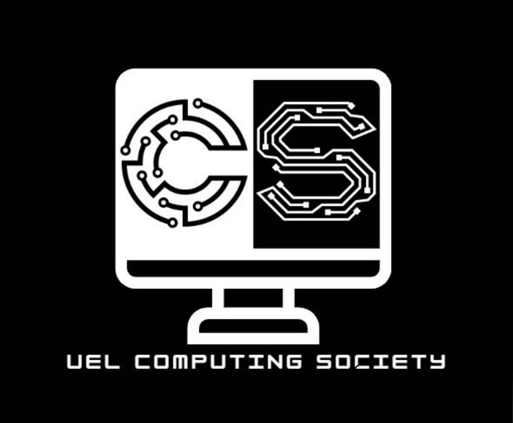

# Computing Society Information

## About the Society
- **Name**: UEL Computing Society <!-- >>Registered with East London Students' Union -->
- **Registration date** : 15/11/2024
- **Mission** :
- **Vision** :
- **Logo** :  

## Meet the Team
### Meet the Team Behind the UEL Computing Society!

- **Nidharshanen Selliah** - _President_  
  Leads the society by setting goals, overseeing operations, and ensuring activities align with its mission. Acts as the primary spokeperson and manages event planning and execution.

- **Yalina Ansari** - _Finance Officer_  
  The mastermind behind our budgeting and resources, Yalina ensures we have the funds to support exciting events and initiatives. They keep our society running smoothly behind the scenes!

- **Fatema Doctor** - _Events Officer_  
  Plan, organize, and oversee society events, including workshops, social gatherings, fundraisers, and competitions. Manage venue booking, equipment, and resources. Ensure smooth event execution and share feedback for improvement.
---

## [Meetings](Meetings.md)

## [Events](Events.md)

## [Projects](Projects.md)

## [Workshops](Workshops.md)

## Contact Details
- **Email**: 
- **Visit our website**: 

## Social Media 
- **Instagram**: [Link](https://www.instagram.com/uel_computingsociety)
- **LinkedIn**: [Link](https://www.linkedin.com/company/uel-computing-society)

